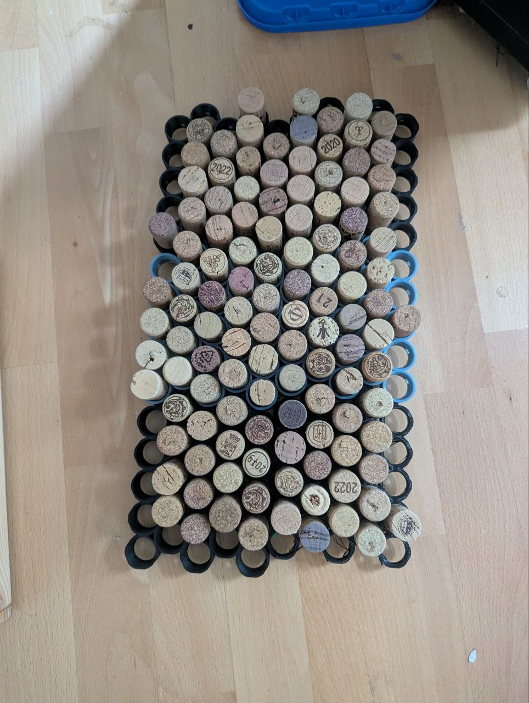

# Corkcarpet — 3D-Printed Wine Cork Shower Mat

On Thingiverse: https://www.thingiverse.com/thing:7415303

A massage shower mat made from ~100 natural wine corks. The corks stand vertically inside a 3D-printed interlocking frame. Only the corks touch the floor — the plastic frame floats 5 mm above the floor, supported entirely by the corks.

## What to Print

For a standard 100-cork mat (approx. 275 × 215 mm) made of 4 tiles:

| File | Quantity | Description |
|---|---|---|
| `tile_5x5_hex.stl` | 4 | 25-socket tile (137.5 × 112.6 × 15 mm, ~82 g PLA). Edge cups are trimmed along the hex cell boundary so tiles nest flush and all tunnels align perfectly. |
| `small_parts_plate.stl` | 1 | Convenience plate containing 12 dowels + 3 spacers in a single 74 × 66 mm print (~20 min). |
| *or* `dowel.stl` | 12 | 4 × 4 × 8 mm square dowel to lock tiles together (printed individually). |
| *or* `spacer.stl` | 3 | 5 mm height spacer, used only during assembly to set the bottom cork offset. |
| `dowel_thin.stl` | Optional | 8 × 3.4 × 4 mm thin dowel — use if the standard 4 × 4 dowel is too tight in your printed tunnels. |
| `dowel_wedge_x12.stl` | Optional (1) | 12 tapered wedge dowels (2 → 5 mm × 10 mm) in one print, printed lying flat. Useful if 3D-printed tunnel ceilings sag and standard square dowels fit too tightly. |

### Cork Fit Test (print this first)

`test_tubes.stl` — 7 sockets with bore Ø18.5 … 21.5 mm in 0.5 mm steps (~30 min, no supports, same orientation as the tile). A notch marks the Ø18.5 end; sizes then go up in a zigzag between the two rows: 18.5, 19.0, 19.5, 20.0, 20.5, 21.0, 21.5.

How to use it:
1. Print it with the same material and profile you will use for the tiles.
2. Press a few typical corks (narrow end down) into each socket. The right size holds the cork firmly by friction but still lets you push it through with your thumb.
3. The tiles are built with Ø20.0. If a different socket fits your corks and printer best, set `SOCKET_D` in `build_tile.py` to that value and regenerate the tile in Blender.
4. Keep the print as a sorting gauge: a cork that drops through Ø20.0 by itself is too thin, one that won't enter Ø21.5 is too thick.

### Slicing & Printing Recommendations
- **Cura profiles**: Included in the `cura/` folder — import `cura/CorkMat_PLA_Fast.curaprofile` (or `cura/CorkMat_PETG_Fast.curaprofile` for PETG) via *Preferences → Profiles → Import*.
- **Tile orientation**: Print flat with socket entry funnels facing down (as exported). No supports needed.
- **Print order**: Print small parts first (~20 min) to test tolerances, then the tiles (~7 hrs each with Fast profile).

## Cork Selection

- **Type**: Solid, natural wine corks with a narrow end of 20–21 mm. Discard corks that are too thin (<20 mm) or too thick (>21.5 mm at the narrow end).
- **Length**: 45–49 mm is typical and works well; length variance does not affect the assembly.

## Assembly

1. **Arrange Tiles**: Place 4 tiles on a flat surface in a 2 × 2 grid. Rotate the top row of tiles by 180° so the staggered hexagonal pattern and interlocking seams mesh together.
2. **Insert Dowels**: On each of the four seams, choose 3 pairs of adjacent socket cups (e.g. both ends and the middle). At 2 mm above the bottom of the cup wall, there is a square tunnel leading into the adjacent socket. Push a 4 × 4 × 8 mm dowel through the tunnel from inside one cup until it spans both walls and protrudes ~1 mm into each socket.
3. **Place Spacers**: Slide 2–3 spacers (5 mm thick) under the frame so the plastic floats above the table.
4. **Press Corks**: Insert corks narrow end down into the socket entry funnel and press down firmly until the cork touches the table. The cork will protrude exactly 5 mm below the bottom of the frame, locking the dowels securely in place. Start with the sockets that contain dowels to lock them first.
5. **Finish**: Remove the spacers. The mat is ready to use!

## Disassembly

To separate tiles, pull out the corks from the sockets containing dowels, push the dowels out, and detach the tiles.

## Care & Maintenance

Natural cork is water-resistant and mold-resistant. Every few months, shake out the mat and let it air-dry. If an individual cork becomes loose over time, simply replace it with a slightly thicker one.

## License

CC BY 4.0 — Creative Commons Attribution 4.0 International.
